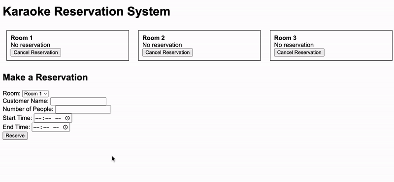

# 🎤 Karaoke Reservation System

A practical tool designed to efficiently manage karaoke room reservations, inspired by the real-life operations at "Nam's Noodle" in Madison, WI. This application helps track bookings and calculate charges all in one place. Built with Python and Flask, this system is perfect for small to medium-sized businesses offering karaoke services.

---

## 📋Table of Contents

- [Features](#features)
- [Demo](#demo)
- [Installation](#installation)
- [Technologies Used](#technologies-used)
- [Inspiration](#inspiration)

---

## ✨Features

- **Reservation Management**: Add or delete reservations based on room availability.
- **Real-Time Availability**: Keep track of which rooms are booked at any given time.
- **Flexible Pricing**: Automatically calculate karaoke charges based on time slots:
  - Early Bird Special: $30/hour (12 PM - 6 PM)
  - Before 9 PM: $45/hour (6 PM - 9 PM)
  - After 9 PM: $50/hour (9 PM - 12 AM)
- **Tax Integration**: Includes a 5.5% sales tax for all calculations.
- **Dynamic Cost Calculation**: Handles overlapping time slots and tax-inclusive pricing.

---

## 🎥Demo

Here’s a glimpse of the Karaoke Reservation System in action:

  
<!-- *(If the GIF isn’t loading, check out the [live demo](#))* -->

---

## ⚙Installation

Follow these steps to run the project locally:

### Steps

1. **Clone the repository**:
   ```bash
   git clone https://github.com/jimmyhe05/karaoke-reservation-system.git
2. **Navigate to the project directory**:
   ```bash
   cd karaoke-reservation-system
3. **Run the application**:
   ```bash
   python app.py
4. **Access the app**:
   ```bash
   Open your browser and go to http://127.0.0.1:5000
---

## 🖥Technologies Used

<a href="https://www.python.org" target="_blank" rel="noreferrer">
 </a>
<a href="https://flask.palletsprojects.com/en/stable/" target="_blank" rel="noreferrer">

</a> 
<a href="https://www.w3.org/html/" target="_blank" rel="noreferrer">
 
</a> 
<a href="https://www.w3schools.com/css/" target="_blank" rel="noreferrer">
 </a> <a href="https://www.docker.com/" target="_blank" rel="noreferrer">
</a>
<a href="https://developer.mozilla.org/en-US/docs/Web/JavaScript" target="_blank" rel="noreferrer">
 
</a> 


---

## 💡Inspiration

The Karaoke Reservation System was inspired by my experience working at "Nam's Noodle," a family-owned restaurant in Madison, Wisconsin. My cousin owns the restaurant, which also features karaoke rooms as part of its unique dining experience.

Managing reservations manually for these rooms was often challenging, especially during peak hours when multiple parties requested overlapping time slots. This inspired me to create a practical and efficient tool to streamline the process of handling room reservations.

---
