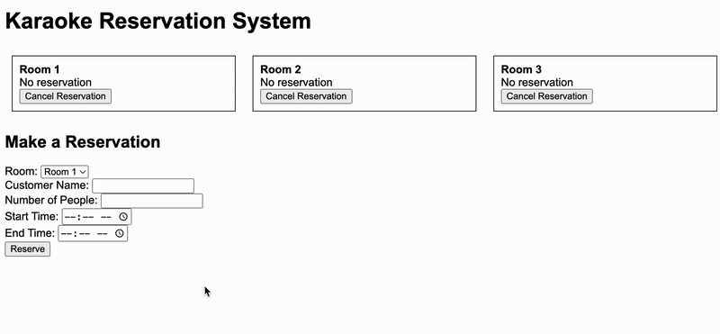

# 🎤 Karaoke Reservation System

A **powerful and user-friendly web application** designed to manage karaoke room reservations efficiently. Inspired by the real-life operations at **Nam's Noodle** in Madison, WI, this system enables **real-time room booking**, **dynamic pricing**, and **automated cost calculations**.

Built with **Python (Flask)** for the backend, **HTML/CSS/JavaScript** for the frontend, and **Bootstrap** for styling, this tool is ideal for small to medium-sized karaoke businesses looking to streamline their operations.

---

## 📋 Table of Contents

- [🎤 Karaoke Reservation System](#-karaoke-reservation-system)
  - [📋 Table of Contents](#-table-of-contents)
  - [✨ Features](#-features)
  - [🎥 Demo](#-demo)
  - [⚙ Installation](#-installation)
    - [Requirements](#requirements)
    - [Setup Steps](#setup-steps)
  - [🖥 Technologies Used](#-technologies-used)
  - [💡 Inspiration](#-inspiration)
  - [🌟 Future Enhancements](#-future-enhancements)
  - [🔗 Connect with Me](#-connect-with-me)

---

## ✨ Features

- **Reservation Management** – Easily add, edit, or remove reservations for available rooms.
- **Real-Time Availability** – Instantly see which rooms are booked and available.
- **Dynamic Pricing System** – Automatically calculates cost based on time slots:
   - 🕛 **Early Bird Special 2026**: $35/hour (11 AM - 6 PM)
   - 🌆 **Evening / Late Night**: $50/hour (6 PM - 1 AM)
- **Business Hours Enforcement** – Karaoke available daily starting at 11 AM; we stay open until 1:00 AM when same-day reservations are made before 9:00 PM.
- **Fresh Song Catalog** – All songs are updated through 2024.
- **Tax Calculation** – 5.5% tax is automatically applied to all reservations.
- **Intuitive UI** – Simple and modern CSS styling, interactive modals, and error messages for an enhanced user experience.
- **Validation & Conflict Handling** – Prevents double bookings and ensures valid time selections.

---

## 🎥 Demo

Here’s a preview of how the system works:
  

---

## ⚙ Installation

### Requirements

- Python 3.x
- pip

### Setup Steps

1. **Clone the repository**:
   ```bash
   git clone https://github.com/jimmyhe05/karaoke-reservation-system.git
   ```

2. **Navigate to the project folder**:
   ```bash
   cd karaoke-reservation-system
   ```

3. **Create a virtual environment (optional but recommended)**:
   ```bash
   python -m venv venv
   source venv/bin/activate  # On Windows use: venv\Scripts\activate
   ```

4. **Install dependencies**:
   ```bash
   pip install -r requirements.txt
   ```

5. **Create a `.env` file in the project root** (auto-loaded by Flask via `python-dotenv`):
   ```bash
   cp .env.example .env

   # (Optional) generate a stronger secret key and replace the value
   python3 - <<'PY'
   import secrets
   print(secrets.token_hex(32))
   PY
   ```

   Then edit `.env` to set at least:

   ```bash
   SECRET_KEY=<your-generated-value>
   DATABASE=karaoke.db
   TAX_RATE=0.055
   FLASK_APP=app.py
   ```

6. **Initialize the database (idempotent)**:
   ```bash
   python -m flask init-db
   ```

7. **(Optional) seed sample reservations for today**:
   ```bash
   python -m flask seed-sample
   ```

8. **Run the Flask application** (loads `.env` automatically):
   ```bash
   python -m flask run
   ```

## Docker

Build and run with SQLite (data persisted in a volume):

```bash
docker build -t karaoke-reservation .
docker run -p 5000:5000 -v karaoke_data:/data --env DATABASE=/data/karaoke.db karaoke-reservation
```

Environment variables you can override:
- `DATABASE` (default `/data/karaoke.db` in the container)
- `SECRET_KEY`, `ADMIN_USERNAME`, `ADMIN_PASSWORD`
- `LOG_LEVEL`, `LOG_FORMAT` (`json` or `text`)

9. **Access the app in your browser**:
   Open http://127.0.0.1:5000.

---

## 🖥 Technologies Used

| Technology   | Description                          |
|--------------|--------------------------------------|
| **Python** 🐍 | Backend logic & calculations         |
| **Flask** 🔥  | Lightweight web framework            |
| **HTML5** 🎨 | Page structure                       |
| **CSS3** 🎭  | Styling & responsiveness             |
| **JavaScript** ✨ | Interactive UI & modal popups     |
| **Bootstrap** 🎨 | Enhanced UI components             |

---

## 💡 Inspiration

This project was inspired by my experience working at **Nam's Noodle**, a family-owned restaurant in **Madison, Wisconsin**. The restaurant features karaoke rooms, and managing reservations manually became a frustrating and time-consuming process.

With this automated system, I aimed to:

- ✅ **Eliminate double bookings**
- ✅ **Streamline reservation management**
- ✅ **Ensure customers are charged correctly**
- ✅ **Improve the overall efficiency of running karaoke services**

Now, managing room availability, pricing, and customer details is fast, simple, and efficient! 🚀

---

## 🌟 Future Enhancements

- **User Authentication** – Secure login for staff & admins.
- **Payment Integration** – Add online payment support.
- **Multi-language Support** – Localized UI for diverse users.

---

## 🔗 Connect with Me

- **GitHub**: [jimmyhe05](https://github.com/jimmyhe05)
- **Email**: jimmyhe05@gmail.com
- **LinkedIn**: [jimmy-he-badger](https://www.linkedin.com/in/jimmy-he-badger/)

Feel free to contribute, report issues, or suggest features! Enjoy your karaoke nights hassle-free! 🎶🎤

---