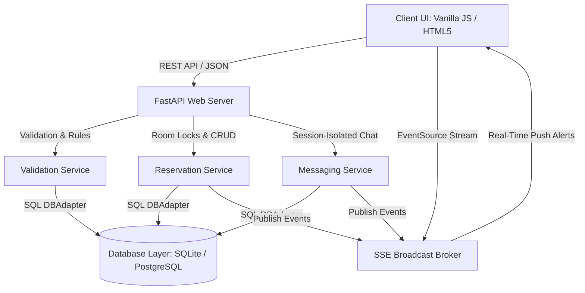

# Karaoke Reservation & Operations System

A production-grade, full-stack web application designed to solve real-world scheduling, reservation management, and live customer support challenges for a high-volume family restaurant in Madison, WI.

This system replaces a fragmented, manual sticky-note workflow with a centralized, real-time booking and queue dashboard. It guarantees transactional integrity, handles complex business rules (including after-midnight operating hours), and provides seamless live communications for staff and customers.

**[Live Demo](https://karaoke-reservation-system.onrender.com/)** — *Login Credentials: Username: `staff` · Password: `demo`*

---

## Developer Motivation & Engineering Goals

As a developer and bartender managing operations at my family's restaurant, I experienced firsthand the limits of paper-based workflows. Front-of-house staff were manually tracking room availability using physical sticky notes per room, leading to scheduling conflicts, double bookings, and pricing calculation errors during peak weekend shifts.

To solve this operational bottleneck, I built this reservation system to meet several technical and architectural goals:
* **Operational Reliability:** Ensure that room bookings are atomic, thread-safe, and free from double-booking conflicts.
* **Real-Time Dashboard Sync:** Provide staff with instant updates of new customer bookings, cancellations, and support queries without manual page reloads.
* **Database Portability:** Support lightweight local development using SQLite, with seamless switching to cloud PostgreSQL (Neon) for production, using a unified data layer.
* **Zero-Dependency Tooling:** Build custom database migrations and build-asset pipelines using standard library features instead of heavy third-party CLI tooling.

---

## System Architecture

The following diagram illustrates the data flow and system boundaries of the application:


```mermaid
graph TD
    Client[Client UI: Vanilla JS / HTML5] -->|REST API / JSON| API[FastAPI Web Server]
    Client -->|EventSource Stream| SSE[SSE Broadcast Broker]
    
    API -->|Validation & Rules| ValService[Validation Service]
    API -->|Room Locks & CRUD| ResService[Reservation Service]
    API -->|Session-Isolated Chat| MessageService[Messaging Service]
    
    ResService -->|SQL DBAdapter| DB[(Database Layer: SQLite / PostgreSQL)]
    ValService -->|SQL DBAdapter| DB
    MessageService -->|SQL DBAdapter| DB
    
    ResService -->|Publish Events| SSE
    MessageService -->|Publish Events| SSE
    SSE -->|Real-Time Push Alerts| Client
```

---

## Technical Deep Dive & Design Decisions

### 1. Database Portability Layer & Raw SQLite/PostgreSQL Compatibility
Rather than relying on a heavy ORM that abstracts away database performance, the system utilizes raw SQL queries inside SQLAlchemy sessions. To handle the dialect and syntax variations between SQLite (local) and PostgreSQL (production Neon), a custom adapter was built in [services/db.py](file:///Users/jimmyhe/Documents/cs-projects/karaoke-reservation-system/services/db.py):
* **Parameter Translation:** The [SqlAlchemyConnectionAdapter](file:///Users/jimmyhe/Documents/cs-projects/karaoke-reservation-system/services/db.py#L92) intercepts raw queries, dynamically translating SQLite `?` placeholders into PostgreSQL `%s` placeholders at runtime when connected to a PostgreSQL database.
* **Compatible Cursor Interface:** A custom [CompatibleCursor](file:///Users/jimmyhe/Documents/cs-projects/karaoke-reservation-system/services/db.py#L61) wraps SQLAlchemy results. This translates raw tuples and SQLite `Row` objects into a unified dictionary-like [DictRowWrapper](file:///Users/jimmyhe/Documents/cs-projects/karaoke-reservation-system/services/db.py#L28), ensuring that service layers receive a consistent row format regardless of the database provider.
* **Native Schema Migration Runner:** Implemented a lightweight migration runner in [migrations/runner.py](file:///Users/jimmyhe/Documents/cs-projects/karaoke-reservation-system/migrations/runner.py) that tracks executed migrations in a `schema_migrations` table, executing incremental SQL scripts sequentially upon server start.

### 2. Transactional Concurrency Control & Double-Booking Prevention
In a multi-user environment, two customers might attempt to book the same room at the same time. To prevent race conditions and guarantee atomic operations:
* **Row-Level Locking:** During the validation and creation lifecycle in [services/reservations.py](file:///Users/jimmyhe/Documents/cs-projects/karaoke-reservation-system/services/reservations.py), the database issues a `SELECT id FROM rooms WHERE id = ? FOR UPDATE` statement. This locks the target room's row inside the transaction.
* **Conflict Validation Isolation:** Any concurrent request checking for overlaps in [services/validation.py](file:///Users/jimmyhe/Documents/cs-projects/karaoke-reservation-system/services/validation.py) on the same room is blocked until the active transaction commits or rolls back, ensuring absolute protection against overbooking.

### 3. Server-Sent Events (SSE) Real-Time Operational Sync
To keep staff updated on booking modifications, walk-in additions, and new customer support messages, the application employs a server-push model:
* **Lightweight Event Streaming:** Built an asynchronous message-passing broker in [app.py](file:///Users/jimmyhe/Documents/cs-projects/karaoke-reservation-system/app.py) leveraging `sse-starlette` to establish persistent, low-overhead HTTP streams with clients.
* **Contextual Client Toasts:** Whenever database modifications occur (e.g. room confirmation, guest message submission), the backend broadcasts structured events. The client-side listener in [static/js/reservation.js](file:///Users/jimmyhe/Documents/cs-projects/karaoke-reservation-system/static/js/reservation.js) parses the payload and presents non-intrusive toast notifications to workers or customers based on their active role permissions.

### 4. Chat Privacy & LocalSession Isolation
The customer support system supports both logged-in users and anonymous walk-in guests:
* **Zero Session Bleed:** To prevent guest chat leakage across different physical machines or logout transitions, the client-side controller in [static/js/reservation.js](file:///Users/jimmyhe/Documents/cs-projects/karaoke-reservation-system/static/js/reservation.js) purges chat cookies and removes temporary identifiers from LocalStorage upon logout.
* **Conditional Badge Tracking:** Unread message indicators are maintained accurately by passing query parameters (`/api/messages?mark_read=false/true`) conditionally: badges only clear when the chat window is explicitly expanded by the user, minimizing unnecessary polling queries.

### 5. Datetime Normalization for Overnight Business Hours
The restaurant operates from 11:00 AM to 1:00 AM the next day. Standard date-based database queries fail when bookings cross midnight (e.g., a booking on Saturday from 11:30 PM to 12:30 AM Sunday).
* **Operational Date Boundaries:** The system normalizes scheduling ranges in [services/validation.py](file:///Users/jimmyhe/Documents/cs-projects/karaoke-reservation-system/services/validation.py) by mapping any time between midnight and the closing limit (1:00 AM) back to the operational "business date" of the previous calendar day.
* **Calendar Offset Adjustments:** When users modify reservations by dragging timeline cards, coordinates are dynamically recalculated in [static/js/improved-layout.js](file:///Users/jimmyhe/Documents/cs-projects/karaoke-reservation-system/static/js/improved-layout.js) relative to the scroll-synchronized container, maintaining pixel-perfect timeline mapping.

### 6. FIFO Walk-in Queue Sorting
Staff can park walk-in parties in an "idle/unassigned" state when rooms are full. 
* **Earliest-Request First:** The queue sidebar retrieves requests sorted by `requested_at ASC` in [routes/api.py](file:///Users/jimmyhe/Documents/cs-projects/karaoke-reservation-system/routes/api.py), guaranteeing a strict First-In, First-Out (FIFO) pipeline.
* **Real-time Calendar Integration:** Unassigned queue reservations are integrated into the daily availability counts, allowing staff to quickly assess capacity directly from the calendar interface.

---

## Technical Stack & Developer Tooling

| Component | Technology |
|---|---|
| **Backend Framework** | FastAPI / Starlette, Python 3 |
| **Databases** | PostgreSQL (Neon Serverless, production) · SQLite (local development) |
| **ORM / Query Engine** | Raw SQL queries with SQLAlchemy connection wrappers |
| **Frontend UI** | Vanilla JavaScript (ES6+), Bootstrap 5, FullCalendar |
| **Real-time Engine** | Server-Sent Events (SSE) via `sse-starlette` |
| **Asset Pipeline** | Minification script using `rjsmin` and `rcssmin` |
| **Testing Suite** | Pytest (78 test cases) |
| **Deployment** | Docker, Render |

### Operations & Scripts
* **Asset Minifier:** A custom asset compilation script in [scripts/build_assets.py](file:///Users/jimmyhe/Documents/cs-projects/karaoke-reservation-system/scripts/build_assets.py) runs on deployment. It parses JavaScript and CSS files using `rjsmin` and `rcssmin` to shrink payload size and enhance page load speeds.
* **SQLite Backups:** A backup utility in [scripts/backup_db.sh](file:///Users/jimmyhe/Documents/cs-projects/karaoke-reservation-system/scripts/backup_db.sh) creates automated, timestamped database snapshots to prevent local data loss.

---

## Quality Assurance & Test Coverage

To ensure system stability, a comprehensive test suite of **78 automated test cases** is maintained in the [tests/](file:///Users/jimmyhe/Documents/cs-projects/karaoke-reservation-system/tests) folder, executed with `pytest`:

```bash
venv/bin/pytest
```

### Coverage Highlights
* **Conflict Detection:** Validates double-bookings, overlaps, and closing hours math.
* **Database Adapter Consistency:** Verifies SQL queries behave identically on SQLite and PostgreSQL.
* **Role-Based Security:** Asserts unauthorized users cannot create/modify bookings or access staff messages.
* **Direct Messaging Flow:** Proves messaging safety, session isolation, and conversation removal endpoints.
* **Auto-Deletion Actions:** Asserts read notifications and rejected bookings delete cleanly.

---

## Local Installation & Setup

> [!NOTE]
> Local installations run in an isolated environment using a local SQLite database (`karaoke.db`) by default. This ensures that testing, running, and configuring the app locally will never interfere with the production PostgreSQL database or live customer data.

### Prerequisites
* Python 3.11+
* pip

### Step-by-Step Guide
1. **Clone the repository:**
   ```bash
   git clone https://github.com/jimmyhe05/karaoke-reservation-system.git
   cd karaoke-reservation-system
   ```
2. **Create and activate virtual environment:**
   ```bash
   python -m venv venv
   source venv/bin/activate       # Windows: venv\Scripts\activate
   ```
3. **Install dependencies:**
   ```bash
   pip install -r requirements.txt
   ```
4. **Configure environment:**
   ```bash
   cp .env.example .env
   # Edit .env and supply SECRET_KEY, STAFF_PASSWORD, and ADMIN_PASSWORD
   ```
5. **Initialize Database Schema:**
   ```bash
   python app.py init-db
   ```
6. **(Optional) Seed sample data:**
   ```bash
   python app.py seed-sample
   ```
7. **Run Development Server:**
   ```bash
   python app.py
   ```
   Open **http://127.0.0.1:5001** in your browser.

### Docker Setup
For quick containerized execution:
```bash
docker build -t karaoke-reservation .
docker run -p 5001:5001 -v karaoke_data:/data --env DATABASE=/data/karaoke.db karaoke-reservation
```

---

## Professional Contact
* **Developer:** Jimmy He
* **LinkedIn:** [jimmyhe05](https://www.linkedin.com/in/jimmyhe05/)
* **Email:** jimmyhe05@gmail.com
* **GitHub:** [jimmyhe05](https://github.com/jimmyhe05)

---

## License & Copyright

Copyright © 2026 Jimmy He.

This project is licensed under the MIT License. See [opensource.org/licenses/MIT](https://opensource.org/licenses/MIT) for the full license text.
